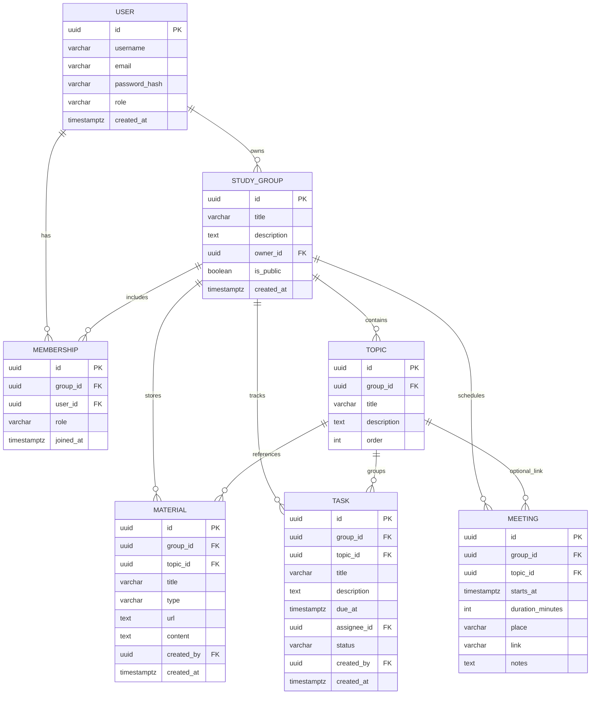

# Вариант 42 — Учебные группы «Соберёмся и решим» 🧪 — ERD (диаграмма сущностей)

Файл содержит: 1) mermaid-ERD; 2) ASCII-эскиз; 3) минимальный SQL DDL-скетч (PostgreSQL).

## Mermaid ERD



## ASCII-эскиз

```text
User 1---* StudyGroup
User *---* StudyGroup (через Membership)
StudyGroup 1---* Topic 1---* (Material/Task/Meeting)
StudyGroup 1---* Meeting
StudyGroup 1---* Material
StudyGroup 1---* Task
```

## Минимальный SQL DDL (пример, PostgreSQL)

```sql
CREATE TABLE users (
	id UUID PRIMARY KEY,
	username TEXT UNIQUE NOT NULL,
	email TEXT UNIQUE NOT NULL,
	password_hash TEXT NOT NULL,
	role TEXT NOT NULL CHECK (role IN ('admin','user')),
	created_at TIMESTAMPTZ NOT NULL DEFAULT now()
);

CREATE TABLE study_groups (
	id UUID PRIMARY KEY,
	title TEXT NOT NULL,
	description TEXT,
	owner_id UUID NOT NULL REFERENCES users(id) ON DELETE CASCADE,
	is_public BOOLEAN NOT NULL DEFAULT true,
	created_at TIMESTAMPTZ NOT NULL DEFAULT now()
);

CREATE TABLE memberships (
	id UUID PRIMARY KEY,
	group_id UUID NOT NULL REFERENCES study_groups(id) ON DELETE CASCADE,
	user_id UUID NOT NULL REFERENCES users(id) ON DELETE CASCADE,
	role TEXT NOT NULL CHECK (role IN ('owner','member')),
	joined_at TIMESTAMPTZ NOT NULL DEFAULT now(),
	UNIQUE (group_id, user_id)
);

CREATE TABLE topics (
	id UUID PRIMARY KEY,
	group_id UUID NOT NULL REFERENCES study_groups(id) ON DELETE CASCADE,
	title TEXT NOT NULL,
	description TEXT,
	"order" INT
);

CREATE TABLE meetings (
	id UUID PRIMARY KEY,
	group_id UUID NOT NULL REFERENCES study_groups(id) ON DELETE CASCADE,
	topic_id UUID REFERENCES topics(id) ON DELETE SET NULL,
	starts_at TIMESTAMPTZ NOT NULL,
	duration_minutes INT NOT NULL,
	place TEXT,
	link TEXT,
	notes TEXT
);

CREATE TABLE materials (
	id UUID PRIMARY KEY,
	group_id UUID NOT NULL REFERENCES study_groups(id) ON DELETE CASCADE,
	topic_id UUID REFERENCES topics(id) ON DELETE SET NULL,
	title TEXT NOT NULL,
	type TEXT NOT NULL CHECK (type IN ('link','file','note')),
	url TEXT,
	content TEXT,
	created_by UUID NOT NULL REFERENCES users(id) ON DELETE RESTRICT,
	created_at TIMESTAMPTZ NOT NULL DEFAULT now()
);

CREATE TABLE tasks (
	id UUID PRIMARY KEY,
	group_id UUID NOT NULL REFERENCES study_groups(id) ON DELETE CASCADE,
	topic_id UUID REFERENCES topics(id) ON DELETE SET NULL,
	title TEXT NOT NULL,
	description TEXT,
	due_at TIMESTAMPTZ,
	assignee_id UUID REFERENCES users(id) ON DELETE SET NULL,
	status TEXT NOT NULL CHECK (status IN ('todo','in_progress','done')),
	created_by UUID NOT NULL REFERENCES users(id) ON DELETE RESTRICT,
	created_at TIMESTAMPTZ NOT NULL DEFAULT now()
);
```